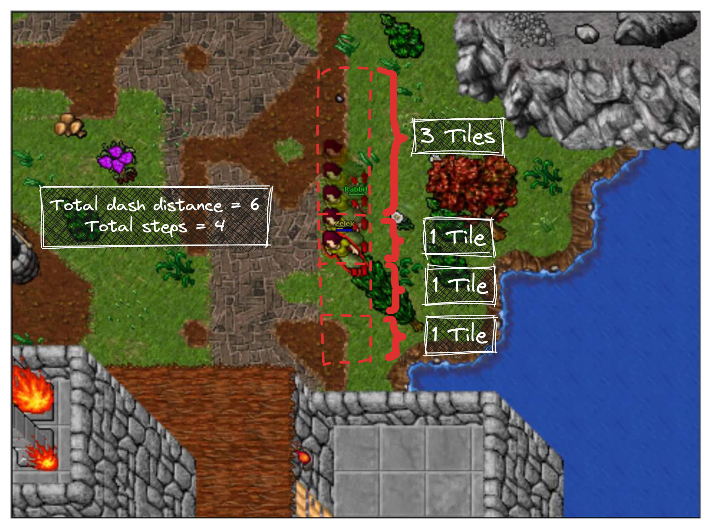
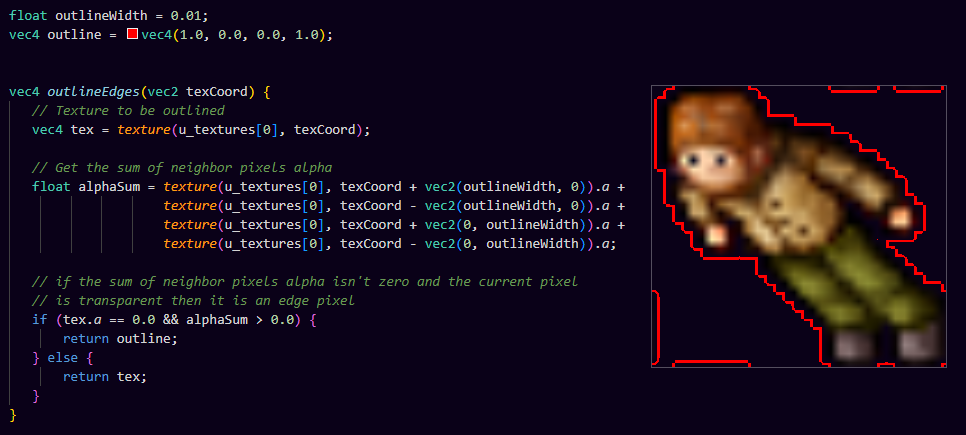

# Q6
Lets break down the reproduction of the dash spell into two main parts
- Server Side Logic (Movement or Teleporting)
- Client Side Logic (Triggering the Spell and Applying Effects using Shaders)

# 1. Server Side Logic
When we look closely we observe that the dash consists of four teleports where the first teleports three tiles and the rest teleport one tile each.


We also notice that when there is an obstacle in the dash path the dash gets interrupted right before the obstacle

Pseudo code
```
- Get player position and direction
- Generate an array of positions where the first is three tiles away and the rest are one tile away from each other
- Create an event teleporting the player to each position respectively with a delay of fifty milliseconds between them
- Before teleporting for each event, iterate through tiles infront of the player one by one until you find an obstacle or reach the teleport destination
```

# 2. Client Side Logic
The effects applied are
- A red outline
- A trail of five identical outfits behind the player, with five different opacities: 100%, 80%, 60%, 40%, and 20%.

Besides that the player rotates without moving

## Triggering the Spell and Rotating
We bind five keys
- **F** to trigger the server dash spell using TalkActions
- **WASD** to rotate the player without moving
```lua
function init()
	-- Trigger dashing with F key
	g_keyboard.bindKeyDown("F", function()
		g_game.talk("!dash")
	end)

	-- Turn around without movement
	g_keyboard.bindKeyDown("W", function()
		g_game.turn(North)
	end)
	g_keyboard.bindKeyDown("S", function()
		g_game.turn(South)
	end)
	g_keyboard.bindKeyDown("D", function()
		g_game.turn(East)
	end)
	g_keyboard.bindKeyDown("A", function()
		g_game.turn(West)
	end)
end
```


## Applying Effects using Shaders
### Adding the Red Outline
We could use a simple fragment shader that gets the four neighbor texels of the current texel and add their alpha values and if the sum is not zero and the current texel has an alpha of zero -not on the outfit texel- then return red otherwise return the original texel, we can use an offset when we are sampling the four neighbors to control the width of the outline



To compile and link our little fragment shader we just simply use `g_shaders.createFragmentShader(name, file)` to get a shader program pointer but we are not done yet.

Unfortunately OTclient doesn't come with a way to pass our shader to be used when drawing our player's outfit while there is one for the map `setMapShader(shader, fadeout, fadein)` so we have to dive in OTClient's source code and implement our own creature shader setting logic.

We add a member variable `m_shader` that will store our generated shader in the creature class and a `setShader()` function which assigns it. Then we need to modify the creature `internalDrawOutfit()` to bind our new shader and set it before drawing then reset it after finishing drawing.

```cpp
// creature.h
public:
// ...
    void setShader(const PainterShaderProgramPtr& shader);
// ...
protected:
// ...
    PainterShaderProgramPtr m_shader;
// ...
```

```cpp
// creature.cpp
#include "shadermanager.h"

void Creature::setShader(const PainterShaderProgramPtr& shader)
{
    if (m_shader == shader)
        return;

    m_shader = shader;
}

void Creature::internalDrawOutfit(Point dest, float scaleFactor, bool animateWalk, bool animateIdle, Otc::Direction direction, LightView *lightView)
{
    // ...
    if (m_shader) {
        m_shader->bind();
        g_painter->setShaderProgram(m_shader);
    }
    // ...
    g_painter->resetShaderProgram();
}
```

And we won't forget to bind it in `luafunctions.cpp` so it can be used it in our `shader.lua` module
```cpp
// ...
g_lua.bindClassMemberFunction<Creature>("setShader", &Creature::setShader);
// ...
```

And finally
```lua
function init()
	-- Apply dash shaders after pressing F key
	g_keyboard.bindKeyPress("F", function()
		local player = g_game.getLocalPlayer()

		local dashShader = g_shaders.createShaders("Dash", "shaders/dash.frag")
		player:setShader(dashShader)

		-- Set default shaders after 300ms to remove dashing effects
		scheduleEvent(undash, 300)
	end)
end

function undash()
	local player = g_game.getLocalPlayer()
	local defaultShader =
		g_shaders.createShaders("Default", "shaders/default/default.frag")
	player:setShader(defaultShader)
end
```
And it works as intended.

### Adding the Trail Effect
Now here where things get a little bit messy, my approach was to stretch the drawing quad in the vertex shader based on direction of the player, and in the fragment shader create five textures with a small offset and different opacities based on direction. In order to do this we need the following.
- Another method that allows us to pass both fragment and vertex shaders
- Passing the player direction to shaders using a uniform
- Setting the uniform before setting the shader program and after binding it
- And of course binding this new method in `luafunctions.cpp`

```cpp
// shadermanager.h
public:
    enum {
        // can be any number as long as it is not occupied
+       DIRECTION_ID_UNIFORM = 9,
// ...
    };
// ...
    PainterShaderProgramPtr createShaders(const std::string& name, std::string fragFile, std::string vertFile);
// ...
```
```cpp
// shadermanager.cpp
PainterShaderProgramPtr ShaderManager::createShaders(const std::string& name, std::string fragFile, std::string vertFile)
{
    PainterShaderProgramPtr shader = createShader(name);
    if (!shader)
        return nullptr;


    vertFile = g_resources.guessFilePath(vertFile, "vert");
    if (!shader->addShaderFromSourceFile(Shader::Vertex, vertFile)) {
        g_logger.error(stdext::format("unable to load vertex shader '%s' from source file '%s'", name, vertFile));
        return nullptr;
    }

    fragFile = g_resources.guessFilePath(fragFile, "frag");
    if (!shader->addShaderFromSourceFile(Shader::Fragment, fragFile)) {
        g_logger.error(stdext::format("unable to load fragment shader '%s' from source file '%s'", name, fragFile));
        return nullptr;
    }

    if (!shader->link()) {
        g_logger.error(stdext::format("unable to link shader '%s' from files '%s'", name, vertFile, fragFile));
        return nullptr;
    }

    // Bind direction uniform
    shader->bindUniformLocation(DIRECTION_ID_UNIFORM, "u_Direction");

    m_shaders[name] = shader;
    return shader;
}
```

And in creature class we set the uniform before drawing
```cpp
// creature.cpp

void Creature::internalDrawOutfit(Point dest, float scaleFactor, bool animateWalk, bool animateIdle, Otc::Direction direction, LightView *lightView)
{
    // ...
    if (m_shader) {
        m_shader->bind();
+       m_shader->setUniformValue(ShaderManager::DIRECTION_ID_UNIFORM, direction);
        g_painter->setShaderProgram(m_shader);
    }
    // ...
}
```
in `luafunctions.cpp`
```cpp
// ...
g_lua.bindSingletonFunction("g_shaders", "createShaders", &ShaderManager::createShaders, &g_shaders);
// ...
```

And our final `shader.lua` module becomes
```lua
function init()
	-- Apply dash shaders after pressing F key
	g_keyboard.bindKeyPress("F", function()
		local player = g_game.getLocalPlayer()

		local dashShader = g_shaders.createShaders("Dash", "shaders/dash.frag", "shaders/dash.vert")
		player:setShader(dashShader)

		-- Set default shaders after 300ms to remove dashing effects
		scheduleEvent(undash, 300)
	end)
end

function undash()
	local player = g_game.getLocalPlayer()
	local defaultShader =
		g_shaders.createShaders("Default", "shaders/default/default.frag", "shaders/default/default.vert")
	player:setShader(defaultShader)
end
```

In dash.vert we shift the vertex and scale it horizontally or vertically by multiplying the 2D vertex by a scaling matrix.
Of course this is not how it should be done as we will see next
```cpp
attribute highp vec2 a_TexCoord;
attribute highp vec2 a_Vertex;
uniform highp mat3 u_TextureMatrix;
uniform highp mat3 u_TransformMatrix;
uniform highp mat3 u_ProjectionMatrix;
varying highp vec2 v_TexCoord;

uniform int u_Direction;

const int North = 0;
const int East = 1;
const int South = 2;
const int West = 3;

mat3 getScaleByDirection() {
  float scaleFactor = 4;

  // Stretching drawing quad with respect to direction to give space for duplicates(trails)
  // by doing some fine tuning -nothing fine here tbh- to reach the desired state
  if (u_Direction == North){
    a_Vertex.y += scaleFactor * scaleFactor;
    return mat3(
        1.0, 0.0, 0.0,
        0.0, scaleFactor, 0.0,
        0.0, 0.0, 1.0
    );
  }
  else if (u_Direction == East) {
    a_Vertex.x += scaleFactor;
    return mat3(
        scaleFactor, 0.0, 0.0,
        0.0, 1.0, 0.0,
        0.0, 0.0, 1.0
    );
  }
  else if (u_Direction == South) {
    a_Vertex.y += scaleFactor;
    return mat3(
        1.0, 0.0, 0.0,
        0.0, scaleFactor, 0.0,
        0.0, 0.0, 1.0
    );
  }
  else if (u_Direction == West) {
    a_Vertex.x += scaleFactor * scaleFactor;
    return mat3(
        scaleFactor, 0.0, 0.0,
        0.0, 1.0, 0.0,
        0.0, 0.0, 1.0
    );
  }
}

highp vec4 calculatePosition() {
    // Apply scaling matrix to stretch the drawing quad vertically
    // and render multiple trails in the fragment shader
    mat3 scale = getScaleByDirection();

    return vec4(u_ProjectionMatrix * u_TransformMatrix * vec3(a_Vertex.xy, 1.0) * scale, 1.0);
}

void main()
{
    gl_Position = calculatePosition();
    v_TexCoord = (u_TextureMatrix * vec3(a_TexCoord,1.0)).xy;
}
```


And our final fragment shader becomes
```cpp
uniform sampler2D u_Tex0;
varying vec2 v_TexCoord;
uniform int u_Direction;

const int North = 0;
const int East = 1;
const int South = 2;
const int West = 3;

float outlineWidth = 0.001;
vec4 outline = vec4(1.0, 0.0, 0.0, 1.0);

vec4 outlineEdges(vec2 texCoord) {
   // Texture to be outlined
   vec4 texture = texture2D(u_Tex0, texCoord);

   // Get the sum of neighbor pixels alpha
   float alphaSum = texture2D(u_Tex0, texCoord + vec2(outlineWidth, 0)).a +
                    texture2D(u_Tex0, texCoord - vec2(outlineWidth, 0)).a +
                    texture2D(u_Tex0, texCoord + vec2(0, outlineWidth)).a +
                    texture2D(u_Tex0, texCoord - vec2(0, outlineWidth)).a;

   // if the sum of neighbor pixels alpha isn't zero and the current pixel 
   // is transparent then it is an edge pixel
   if (texture.a == 0.0 && alphaSum > 0.0) {
       return outline;
   } else {
       return texture;
   }
}

void main() {
    vec2 texCoord = v_TexCoord;

    // Offset for the duplicate trail texture
    vec2 trailOffset;

    // Reversing stretch effect with respect to direction
    // by doing more "fine tuning"
    if (u_Direction == North){
      trailOffset = vec2(0.0, 0.015);
      texCoord.y *= 4.0;
      texCoord.y -= 0.175;
    }
    else if (u_Direction == East) {
      trailOffset = vec2(0.015, 0.0);
      texCoord.x *= 4.0;
      texCoord.x -= 0.77;
    }
    else if (u_Direction == South) {
      trailOffset = vec2(0.0, 0.015);
      texCoord.y *= 4.0;
      texCoord.y -= 0.175;
    }
    else if (u_Direction == West) {
      trailOffset = vec2(0.015, 0.0);
      texCoord.x *= 4.0;
      texCoord.x -= 1.45;
    }

    // Main texture outlined
    vec4 mainTex = outlineEdges(texCoord);

    // Multiple trails with different offsets
    vec4 trailTex[4];
    for (int i = 0; i < 4; i++) {
      trailTex[i] = texture2D(u_Tex0, texCoord + trailOffset * (i - 1));
    }

    // Combine trails with the main texture
    vec4 output = mix(trailTex[0], mainTex, mainTex.a);
    for (int i = 1; i < 4; i++) {
        output = mix(trailTex[i], output, output.a);
    }

    gl_FragColor = output;
}
```

Now to the final result


Probably it looks like this because we have one texture for all poses of the outfit like the this image of Link's 2D sprite
